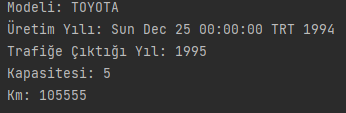

# week1-Q1

## Object
Belirlenmiþ ön koþullara göre Immutable Class oluþturmak.

### Immutable bir Car Sýnýfý oluþturalým.
#### Attributes
- model -> enum
- yýl   -> int
- kapasite -> int
- uretimTarihi -> date
- km -> int
- color -> Java.Color

#### Output
- 