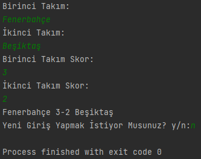
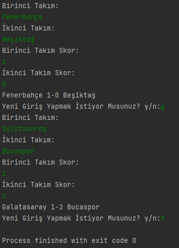
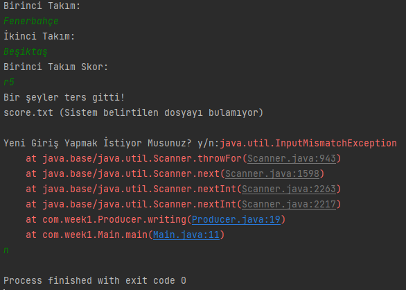

# week1-Q2

## Object
"score.txt" dosyasý oluþturup verilen maç skorlarýný dosyaya ve ardýndan ekrana yazdýrmak

#### Consumer, Producer ve Main classlarý oluþturuldu

### Output - 1

### Output - 2 -> Yenilebilirliðin test edildiði case

### Output - 3 -> Skorun integer girilmemesi halinde hata alýnan case

