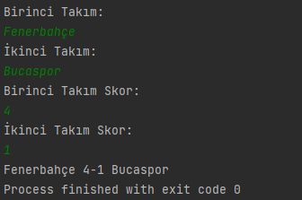
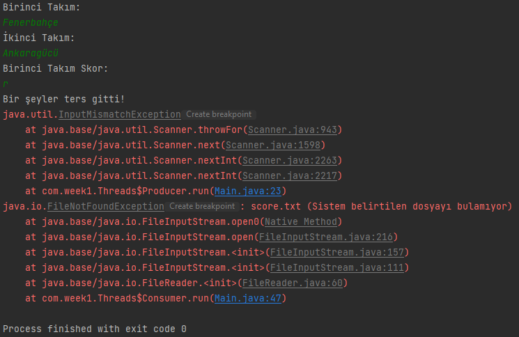

# week1-Q3

## Object
Threadlerle input edilen maç skorlarýný dosyaya ve ardýndan ekrana yazdýrmak

#### Threads ve Main classlarý oluþturuldu

### Output - 1

### Output - 2 -> Skorun integer girilmemesi halinde hata alýnan case

